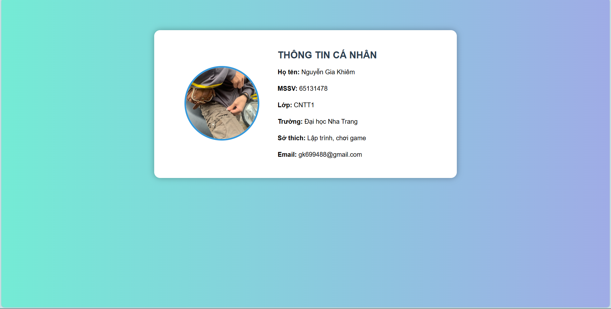

# 🌟 AboutMe Servlet Project

Project **AboutMe** là một ứng dụng web Java đơn giản sử dụng **Servlet (Jakarta)** chạy trên **Apache Tomcat 10.1**, cho phép hiển thị trang giới thiệu thông tin cá nhân với giao diện đẹp, có ảnh đại diện hình tròn và bố cục 2 cột.

---

## 📌 Chức năng

- Client gửi GET request:
http://localhost:8080/ViduGetPost/AboutMe

- Server trả về trang giới thiệu cá nhân:
- Ảnh đại diện hình tròn (bên trái)
- Thông tin cá nhân (bên phải)

---

## 🛠 Công nghệ sử dụng

- Java Servlet (Jakarta EE)
- Apache Tomcat 10.1
- HTML, CSS
- Eclipse IDE

---

---

## ▶ Cách chạy project

1. Import project vào Eclipse  
2. Cấu hình Tomcat 10.1  
3. Chuột phải project → **Run As → Run on Server**  
4. Mở trình duyệt và truy cập:

http://localhost:8080/ViduGetPost/AboutMe

## 🖼 Giao diện minh họa

---

## ✨ Mô tả giao diện

- Nền gradient hiện đại  
- Thẻ (card) bo góc, có bóng đổ  
- Ảnh đại diện bo tròn  
- Bố cục 2 cột rõ ràng  

---

## 👤 Tác giả

- Họ tên: Nguyễn Gia Khiêm  
- Lớp: 65.CNTT_CLC  
- Email: gk699488@gmail.com  

---

