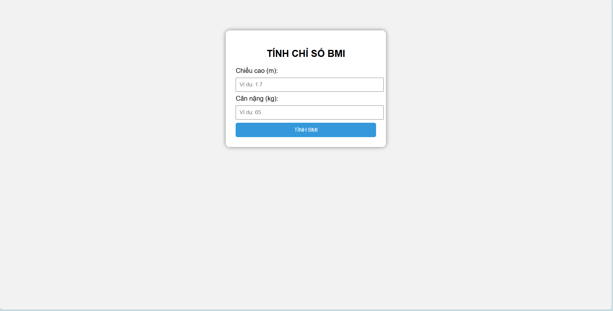
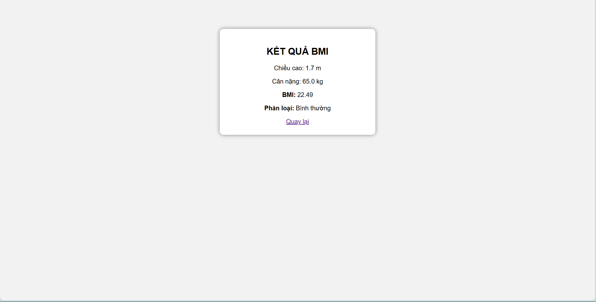

# 🧮 BÀI 1.4 - ỨNG DỤNG TÍNH BMI (JAVA SERVLET)

## 📌 Mô tả
Ứng dụng web tính chỉ số BMI (Body Mass Index) sử dụng Java Servlet.

Chức năng:
- Hiển thị form nhập chiều cao và cân nặng (GET request)
- Xử lý dữ liệu và tính BMI (POST request)
- Hiển thị kết quả và phân loại thể trạng

---

## 🚀 Công nghệ sử dụng
- Java Servlet (Jakarta EE)
- Apache Tomcat 10.1
- HTML, CSS
- JSP

---

## ▶️ Cách chạy chương trình

1. Import project vào Eclipse  
2. Cấu hình Apache Tomcat  
3. Chạy project trên server  
4. Truy cập:

http://localhost:8080/BMI

---

## 📝 Cách sử dụng

- Nhập chiều cao (m)  
- Nhập cân nặng (kg)  
- Nhấn **Submit**  
- Xem kết quả BMI và phân loại

---

## 📊 Công thức BMI

BMI = cân nặng / (chiều cao * chiều cao)

## 📷 Giao diện minh họa

## 👨‍🎓 Sinh viên thực hiện

Họ tên: Nguyễn Gia Khiêm

MSSV: 65131478

Lớp: 65.CNTT_CLC

